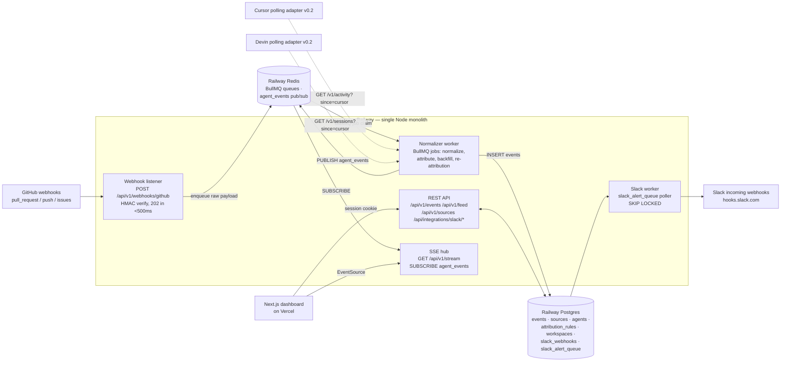
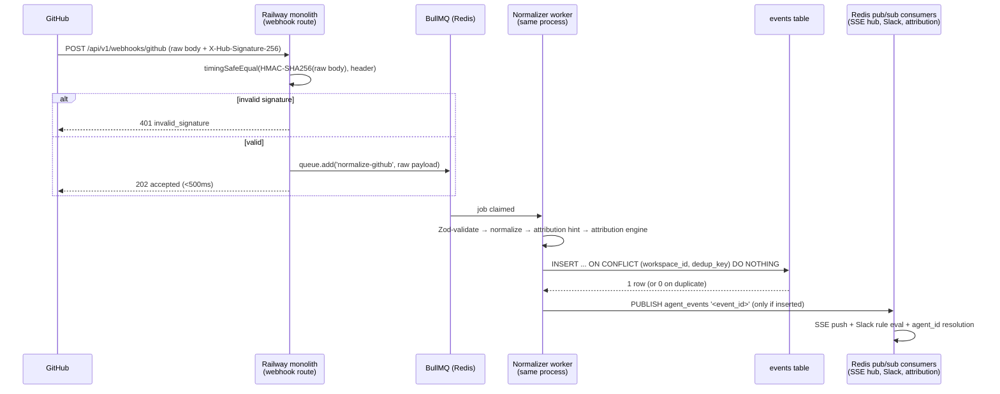
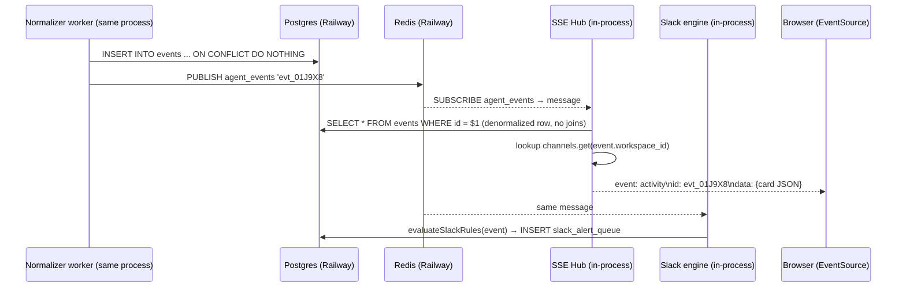
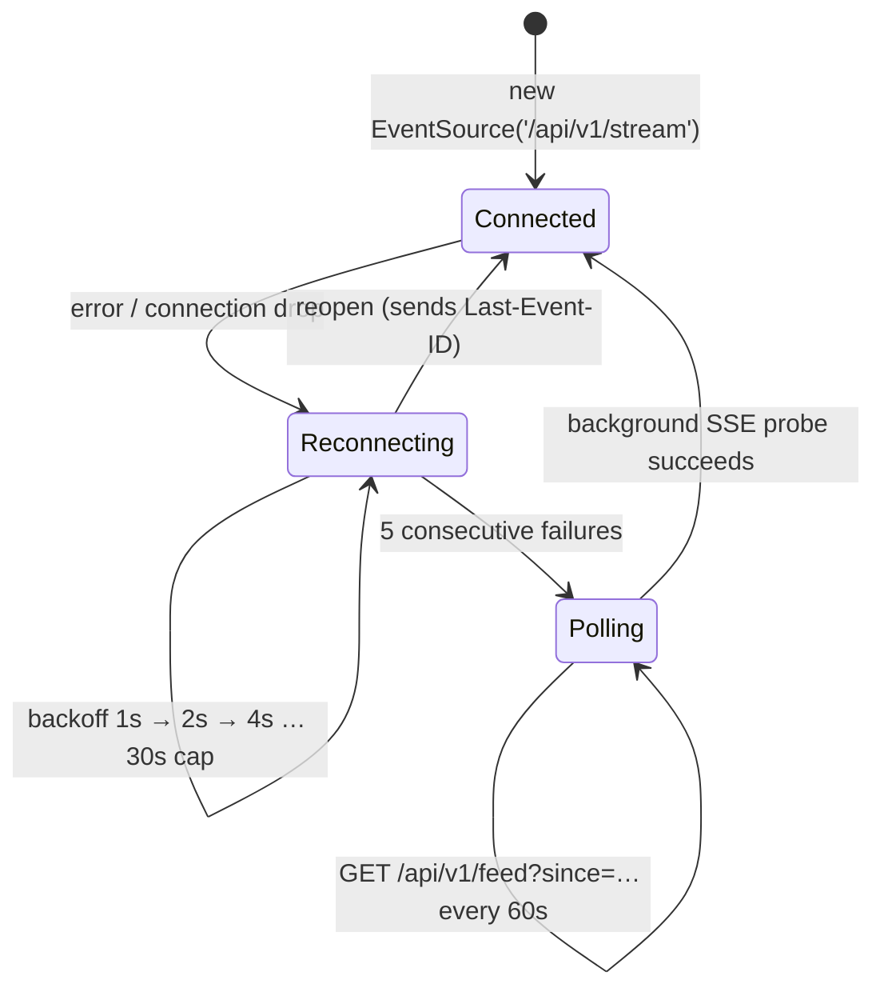
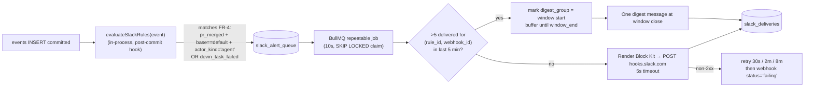
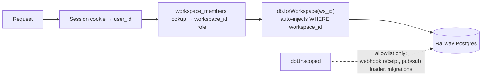
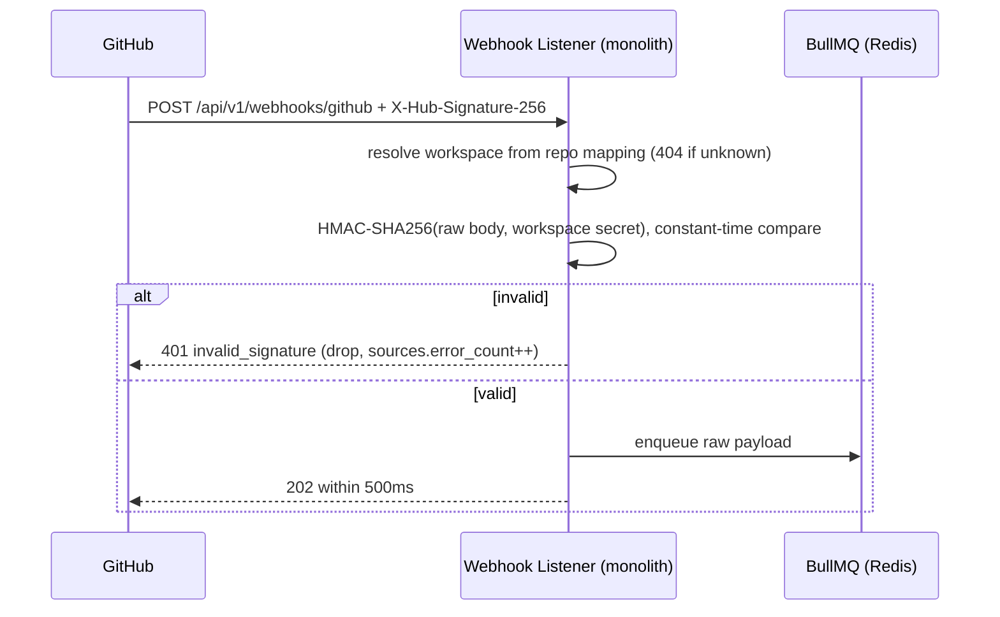
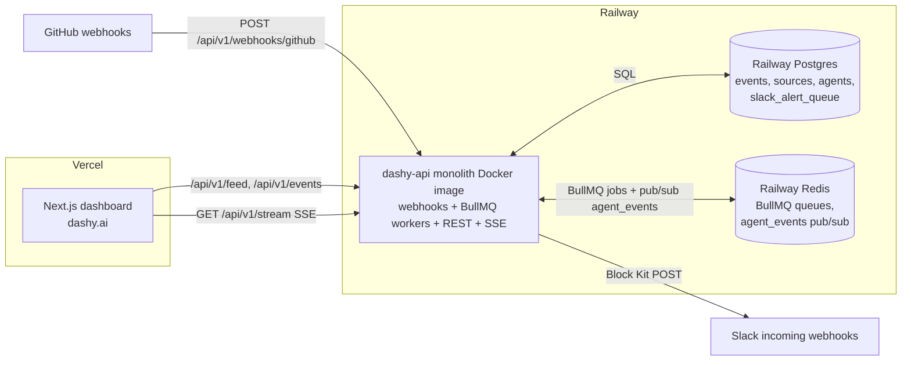
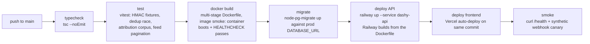

# Dashy.ai — System Architecture

| | |
|---|---|
| **Product** | Dashy.ai — Overnight activity dashboard for AI coding agents |
| **Owner** | Kurt Jallo |
| **Status** | Draft |
| **Last Updated** | 2026-06-12 |
| **Companion docs** | [PRD.md](PRD.md) · [FEATURE-SPECS.md](FEATURE-SPECS.md) |

## Contents

1. System Overview & Architecture Decisions
2. Data Model
3. Ingestion Pipeline
4. Real-Time Delivery & Notifications
5. Security & Multi-Tenancy
6. Deployment, Operations & Scaling

---

## 1. System Overview & Architecture Decisions

### 1.1 System Overview

Dashy.ai is an overnight activity dashboard for AI coding agents: it ingests GitHub activity (PRs, pushes, issues) produced by agents like Claude Code, Cursor, Devin, and Copilot, attributes each event to the agent (or human) that produced it, and surfaces everything in a morning-briefing feed with live SSE updates and Slack alerts for critical merges and failed runs. v0.1 is GitHub-only ingestion; Cursor and Devin polling adapters land in v0.2 with no schema change.

The system is deliberately small: **one always-on Node process on Railway** (webhook listener + normalizer/attribution worker + REST API + SSE hub, with BullMQ workers for async jobs), **one Railway Postgres database** (the state of record), **one Railway Redis** (BullMQ job queues + pub/sub fan-out), and a **Next.js frontend on Vercel**. The monolith ships as a single Docker image, and there is no second backend service to operate — a solo founder can deploy, debug, and page-respond on this in a 1–2 week MVP window while still hitting the spec targets: dashboard load <2s p95, event-to-stored <60s p95, Slack alert <2min p95, 99.5% uptime.



#### Hot path 1: webhook → stored event → SSE push → Slack alert

1. GitHub POSTs to `POST /api/v1/webhooks/github` with `X-GitHub-Delivery`, `X-GitHub-Event`, `X-Hub-Signature-256`. The listener verifies HMAC-SHA256 against the per-workspace secret (encrypted in `sources.config`), persists the raw payload, enqueues a BullMQ `normalize-event` job, and responds `202` in <500ms. Invalid signature → `401`, no insert.
2. The normalizer worker (same process) maps the payload to the unified schema (`pull_request.opened → pr_opened`, etc.), runs the attribution engine inline (<500ms/event; sets `actor_kind`, `agent_id`, `confidence ∈ {exact, inferred, unknown}` denormalized onto the row), computes `dedup_key` (`gh:{delivery_guid}`), and inserts into `events` with `ON CONFLICT (workspace_id, dedup_key) DO NOTHING`. Replayed deliveries produce exactly one row. Budget: `stored_at − occurred_at` <60s p95 (logged per event from day one).
3. On successful insert the worker publishes the event ID to the Redis `agent_events` pub/sub channel. The SSE hub holds one Redis subscriber connection on `agent_events`, loads the row, and pushes it to the in-process connection map keyed by `workspace_id` — open dashboards see the new card without refresh, with `Last-Event-ID` replay (last 1,000 events/workspace) on reconnect.
4. The same post-insert hook runs `evaluateSlackRules(event)`: `action_type='pr_merged'` + base==default branch + `actor_kind='agent'` → `protected_branch_merge`; `action_type='devin_task_failed'` → `agent_run_failed`. Matches insert rows into `slack_alert_queue`; a 10s poller claims due rows with `SELECT ... FOR UPDATE SKIP LOCKED`, applies the >5-in-5-min digest collapse, renders Block Kit, and POSTs to `hooks.slack.com` (retries 30s/2m/8m). End-to-end target: <120s p95 from ingestion, measured via `slack_deliveries`.

#### Hot path 2: morning dashboard load

1. User hits the Vercel-hosted dashboard; the Next.js server component fetches `GET /api/v1/feed` from the Railway API with the session cookie (GitHub OAuth, workspace-scoped).
2. The API computes the window `max(users.last_seen_at, 6pm yesterday in users.timezone)`, runs one aggregate query (summary counts via `FILTER` clauses) plus page 1 (20 cards) using keyset pagination on `(occurred_at DESC, id DESC)` against `idx_events_feed (workspace_id, occurred_at DESC)`. Budget: feed query p95 <400ms at 1M rows / 10k per workspace.
3. The page hydrates with summary + first cards (<2s p95 FCP), opens `EventSource('/api/v1/stream')` for live updates, and infinite-scrolls history in pages of 50. On unload, `sendBeacon` to `POST /api/v1/me/last-seen` updates the next morning's window.

### 1.2 Architecture Decision Records

#### ADR-001: Single always-on Node monolith on Railway (vs serverless functions + managed queue)

- **Context.** The pipeline needs four long-lived behaviors: a webhook receiver, an async normalizer, an SSE hub holding open connections plus a Redis subscriber, and a Slack delivery poller. Serverless (Vercel functions) handles the receiver well but is hostile to SSE, long-lived Redis subscriptions, and interval pollers; splitting across functions + QStash + a worker means 3+ deploy targets for one founder.
- **Decision.** One Node process on Railway runs all four roles, built and deployed as a single Docker image (ADR-007). Vercel hosts only the Next.js frontend. Webhook ack <500ms is trivial since processing is deferred to BullMQ.
- **Consequences.** One deploy, one log stream, one set of env vars (`DATABASE_URL`, `REDIS_URL`, `ENCRYPTION_KEY`, `GITHUB_OAUTH_CLIENT_ID/SECRET`, `SESSION_SECRET`). Two stateful backing services (Postgres as state of record, Redis for queues + pub/sub), still one app process to operate. Single instance means a deploy restart drops SSE connections (clients auto-reconnect with `Last-Event-ID`) and pauses ingestion for seconds — fine within the 99.5% (~3.6h/month) budget; queued BullMQ jobs survive the restart in Redis. GitHub redelivery + the FR-7 reconciliation backfill cover any missed webhooks during restarts. Running a second instance is possible from day one (Redis pub/sub fans out to all instances; BullMQ is multi-worker-safe) — it's gated by need, not architecture.
- **Revisit when:** sustained webhook volume saturates one instance (~5,000 events/day/team × dozens of teams), or 99.5% is repeatedly missed due to deploy/restart gaps — then split the webhook receiver out first.

#### ADR-002: In-process SSE via Redis pub/sub (vs Pusher/Ably)

- **Context.** FR-5/US-3 require new events on open dashboards within 60s without refresh. Managed pub/sub (Pusher/Ably) adds a vendor, a bill, and client SDK weight for what is one-way fan-out to a small number of concurrent sessions. Redis is already in the stack for BullMQ (ADR-003), so its pub/sub is free to use.
- **Decision.** The monolith keeps an in-memory map `workspace_id → Set<SSEConnection>`; insert → `PUBLISH agent_events '<event_id>'` on Redis → push. Heartbeat comment every 25s defeats proxy timeouts; client retries with backoff and replays via `Last-Event-ID` (from Postgres, the durable buffer); after 5 failed reconnects the client degrades to 60s polling of `GET /api/v1/events`.
- **Consequences.** No new infra beyond the Redis BullMQ already requires, and latency well under target. The design scales past one instance with no rework: Redis pub/sub fans out to every instance holding a subscription, so each app instance independently receives every event and pushes to its own local connection map. Adding a second or third instance costs ~nothing — only the in-process "emitter shortcut" (pushing directly without round-tripping through Redis) degrades, and each instance holds one dedicated Redis subscriber connection (cheap; Redis handles thousands). Pub/sub is fire-and-forget, but a missed message is recovered by `Last-Event-ID` replay from Postgres.
- **Revisit when:** thousands of concurrent dashboard SSE sessions (well past the PRD §7.4 ~500-session lever) or SSE delivery reliability issues appear — then move SSE termination to managed pub/sub (Pusher/Ably) and let the monolith just publish.

#### ADR-003: BullMQ on Redis for async jobs (vs pg-boss on Postgres or Upstash QStash)

- **Context.** Async work is modest: normalize webhook payloads, connect-time 24h backfill, 30-day re-attribution batches (500 rows/iteration), Slack delivery retries, plus cron-style repeatable jobs (watchdog, retention purge, canary). A Postgres-backed queue (pg-boss) would avoid a second stateful service, but the owner prefers industry-standard tooling: BullMQ is the de-facto Node job queue, with a deep ecosystem (dashboards like Bull Board, battle-tested retry/backoff, repeatable jobs) and abundant documentation.
- **Decision.** BullMQ queues and workers on a managed Railway Redis. Retries + backoff and failed-job retention come out of the box (normalizations that exhaust 3 attempts land in BullMQ's failed set *and* are written to `events_dead_letter` for replay); repeatable jobs cover the cron needs; the Slack `slack_alert_queue` table keeps its `SKIP LOCKED` semantics, drained by a BullMQ repeatable job.
- **Consequences.** One more stateful service to provision and pay for (~$5–10/mo managed Railway Redis) — but it's ephemeral queue/pub-sub state, needs no backups, and the state of record stays Postgres: any job lost in a worst-case Redis wipe is recoverable via the FR-7 reconciliation backfill. Bonus: Redis pub/sub replaces Postgres LISTEN/NOTIFY for SSE fan-out (ADR-002), so the multi-instance constraint disappears. Enqueue is no longer transactional with the event insert; idempotent dedup keys make that a non-issue.
- **Revisit when:** Redis cost or ops burden ever outweighs the ecosystem benefit at tiny scale (unlikely), or queue throughput needs exceed a single Redis (~post-PMF) — then shard queues or move to a managed queue service.

#### ADR-004: App-layer tenancy scoping (vs Postgres Row-Level Security)

- **Context.** Every table carries `workspace_id`; the PRD mandates zero cross-tenant access. RLS gives defense-in-depth but requires per-request `SET LOCAL` session variables, complicates pooled connections and BullMQ workers (which operate across workspaces), and makes `EXPLAIN`-level query tuning harder under a 10-day build.
- **Decision.** App-layer scoping: `workspace_id` is always resolved from the session, never from client input; every repository-layer query takes it as a mandatory parameter; `repo_ids`/`actor_ids` are validated as workspace members (403 otherwise). An automated authz test suite asserts cross-workspace requests return 403/empty (the filters spec's acceptance criterion 9), plus a manual pen check before pilot.
- **Consequences.** Simple, fast, and compatible with cross-tenant workers (backfill, Slack poller, re-attribution). The risk is a single forgotten `WHERE workspace_id =` — mitigated by funneling all event reads through the one canonical `GET /api/v1/events` query builder and the test suite.
- **Revisit when:** the first enterprise/SOC 2 Type I customer demands defense-in-depth, a tenancy bug ships, or team size grows beyond one (more hands = more chances to miss a scope) — RLS can be layered on without schema changes since `workspace_id` already exists everywhere.

#### ADR-005: Next.js (App Router) frontend on Vercel

- **Context.** Dashboard load must be <2s p95; the founder is one person using shadcn/ui + Tailwind; the PRD stack already standardizes on Next.js.
- **Decision.** Next.js on Vercel, server-fetching the initial feed payload (summary + 20 cards) so first paint beats 2s, then hydrating a client component with `EventSource` + SWR. GitHub OAuth session cookie shared with the Railway API. Edge caching disabled for the user-specific feed route; static assets/fonts CDN-cached. Web Vitals tracked via Vercel Analytics.
- **Consequences.** Zero-ops frontend deploys, preview deployments for free, and the API stays on Railway where SSE works (SSE through Vercel is explicitly avoided per the feed spec's risk list). Cost: CORS/cookie config across two domains (`dashy.ai` → `api.dashy.ai`), one extra moving part in incident triage.
- **Revisit when:** Vercel costs outgrow value or the split-domain auth causes recurring bugs — the Next.js app could be served from the Railway box, trading CDN performance for one deploy target.

#### ADR-006: Defer Cursor/Devin adapters to v0.2; ship schema and cursors now

- **Context.** The 10-day MVP can't absorb two young, unstable third-party APIs (~1.5d of work plus ongoing breakage risk; Cursor's team-activity API access tier is still an open question). Meanwhile every supported agent ultimately lands work in GitHub as PRs/commits/issues, so GitHub-only ingestion covers what the feed, digest, and alerts center on.
- **Decision.** v0.1 ingests GitHub only, but ships the source-agnostic pieces: the unified `events` schema, the `sources` and `sync_cursors` tables, canonical agent slugs (`claude-code`, `cursor`, `devin`, `copilot`, `custom:<name>`), and dedup keys reserved for `cu:{activity_id}` / `dv:{session_id}:{status}`. `POST /api/v1/sources` returns `422 source_type_not_yet_available` for cursor/devin; onboarding shows them as "Coming in v0.2" cards. v0.2 is a 60s-interval polling loop in the existing worker that advances `sync_cursors.cursor_value` only after successful insert (at-least-once + dedup = exactly-once stored) — no migration, no new service.
- **Consequences.** Local Cursor sessions and Devin tasks that never touch GitHub are invisible in v0.1 — stated explicitly in onboarding copy. Attribution still labels Cursor/Devin work via bot logins, trailers, and branch prefixes on GitHub events. Devin-failure Slack alerts (`devin_task_failed`) only activate in v0.2.
- **Revisit when:** pilot feedback ranks session-level visibility as a top-3 gap, or Cursor/Devin API access is confirmed — v0.2 is scheduled immediately after the Week 3–6 pilot starts in either case.

#### ADR-007: Docker for the Railway monolith (vs Nixpacks buildpack)

- **Context.** Local dev now needs three services (app, Postgres, Redis); prod runs the same trio on Railway + managed Redis. Buildpack magic (Nixpacks) is convenient until local and prod drift on Node version, native deps, or env wiring.
- **Decision.** The monolith is built as a multi-stage Docker image (deps → build → slim `node:22-alpine` runtime, non-root user, `HEALTHCHECK` hitting `/health`). Railway deploys from the Dockerfile; local dev runs `docker-compose up` with three services — `app`, `postgres`, `redis` — so dev and prod are byte-for-byte the same runtime. Industry standard; zero surprises.
- **Consequences.** One Dockerfile to maintain and a slightly slower cold build than Nixpacks, in exchange for dev/prod parity, reproducible builds in CI (GitHub Actions builds the image), and a trivially portable artifact if Railway ever stops being the right host.
- **Revisit when:** never, realistically — this is the boring default.

---

## 2. Data Model

All persistent state lives in a single Railway Postgres instance. Table and column names below are taken verbatim from FEATURE-SPECS.md; where the specs are silent (e.g., `attribution_rules`, the events dead-letter table) the gap is filled consistently with the same conventions: TEXT primary keys carrying prefixed ULIDs (`ws_`, `usr_`, `evt_`, `src_`, `agt_`, `rule_`, `wh_`, `repo_`), `workspace_id` on every tenant-scoped row, and `TIMESTAMPTZ` everywhere. Note on naming: the specs do **not** define standalone `slack_configs` or `filter_preferences` tables — Slack configuration is `slack_webhooks` + `slack_alert_rules` (+ `slack_alert_queue`, `slack_deliveries`), and filter preferences are columns on `users` (`default_filters`, `timezone`, `theme`, `feed_grouping`, `last_seen_at`). Those spec-canonical shapes are used here.

### 2.1 ERD

```mermaid
erDiagram
    workspaces ||--o{ workspace_members : "has"
    users ||--o{ workspace_members : "joins"
    workspaces ||--o{ workspace_repos : "monitors"
    workspaces ||--o{ sources : "connects"
    workspaces ||--o{ events : "owns"
    workspaces ||--o{ agents : "defines"
    workspaces ||--o{ attribution_rules : "configures"
    workspaces ||--o{ slack_webhooks : "registers"
    workspaces ||--o{ slack_alert_rules : "configures"
    workspaces ||--o{ integrations : "stores creds"
    workspaces ||--o{ invites : "issues"
    workspaces ||--o{ backfill_jobs : "runs"
    sources ||--o{ events : "produces"
    sources ||--o{ sync_cursors : "tracks"
    agents ||--o{ events : "attributed to"
    agents ||--o{ attribution_rules : "targeted by"
    users ||--o{ attribution_rules : "created by"
    slack_webhooks ||--o{ slack_alert_rules : "targets"
    workspace_repos ||--o{ slack_alert_rules : "scopes"
    slack_alert_rules ||--o{ slack_alert_queue : "enqueues"
    slack_webhooks ||--o{ slack_alert_queue : "delivers via"
    events ||--o{ slack_alert_queue : "triggers"
    slack_webhooks ||--o{ slack_deliveries : "logged"

    workspaces {
        text id PK "ws_<ulid>"
        text name
        timestamptz onboarded_at
        timestamptz created_at
    }
    users {
        text id PK "usr_<ulid>"
        bigint github_id UK
        text github_login
        text email
        text avatar_url
        bytea gh_token_enc "AES-256-GCM"
        timestamptz last_seen_at "offline-summary window"
        text timezone "IANA, default UTC"
        text theme "dark|light, default dark"
        text feed_grouping "repo|agent|impact"
        jsonb default_filters "saved filter default; null = overnight"
        timestamptz created_at
    }
    workspace_members {
        text workspace_id PK,FK
        text user_id PK,FK
        text role "admin|member"
        timestamptz joined_at
    }
    workspace_repos {
        text id PK "repo_<ulid>"
        text workspace_id FK
        bigint github_repo_id
        text full_name "owner/name"
        bigint webhook_id "GitHub hook id"
        text webhook_status "pending|installed|failed"
    }
    sources {
        text id PK "src_<ulid>"
        text workspace_id FK
        text type "github|cursor|devin"
        text status "active|error|paused"
        jsonb config "encrypted api_key, encrypted webhook HMAC secret, repo list"
        int error_count
        timestamptz last_event_at
        timestamptz last_poll_at
        timestamptz created_at
    }
    sync_cursors {
        text source_id PK,FK
        text stream PK "activity|sessions|pulls|issues|commits"
        text cursor_value "timestamp or opaque page token"
        timestamptz updated_at
    }
    events {
        text id PK "evt_<ulid>"
        text workspace_id FK
        text source_id FK
        text source "github|cursor|devin"
        text agent_id FK "authoritative; set by attribution"
        text agent_hint "ingestion-time hint, never displayed"
        text repo "owner/name, nullable"
        text actor "login at source"
        text actor_kind "agent|human|unattributed"
        text actor_login
        text confidence "exact|inferred|unknown"
        jsonb attribution_signals
        jsonb co_actors
        jsonb attribution_flags
        boolean manual_override
        int attribution_version
        text action_type "9-value enum, CHECK"
        text impact "high|medium|low, CHECK"
        timestamptz occurred_at "source timestamp"
        timestamptz stored_at "insert time; latency SLO"
        text dedup_key "unique per workspace"
        jsonb payload_ref "source summary <=8KB; incl. base/default branch for pr_merged"
    }
    agents {
        text id PK "agt_<ulid>"
        text workspace_id FK
        text slug "claude-code|cursor|devin|copilot|custom:<name>"
        text display_name
        boolean is_builtin
        timestamptz created_at
    }
    attribution_rules {
        text id PK "rule_<ulid>"
        text workspace_id FK
        text rule_type "login|email_glob|branch_prefix"
        text pattern
        text agent_id FK
        text created_by FK
        boolean enabled
        timestamptz created_at
    }
    slack_webhooks {
        text id PK "wh_*"
        text workspace_id FK
        text name
        bytea url_encrypted "AES-256-GCM"
        text url_masked
        text status "active|failing"
        timestamptz last_delivery_at
        timestamptz created_at
    }
    slack_alert_rules {
        text id PK "rule_*"
        text workspace_id FK
        text webhook_id FK "SET NULL on webhook delete"
        text repo_id FK "NULL = all repos"
        text_array event_types "protected_branch_merge|agent_run_failed"
        boolean enabled
        timestamptz created_at
    }
    slack_alert_queue {
        bigserial id PK
        text rule_id FK
        text webhook_id FK
        text event_id FK
        text status "pending|digesting|delivered|failed|expired"
        timestamptz digest_group "burst-collapse window start"
        smallint attempts
        timestamptz next_attempt_at
        timestamptz created_at
    }
    slack_deliveries {
        bigserial id PK
        text webhook_id
        text rule_id
        text event_id
        text status "delivered|failed"
        smallint slack_status_code
        int latency_ms
        boolean is_digest
        timestamptz created_at
    }
    integrations {
        text id PK
        text workspace_id FK
        text provider "cursor|devin (slack removed; owned by slack_webhooks)"
        bytea credential_enc
        text status
    }
    invites {
        text token PK "32-byte random"
        text workspace_id FK
        timestamptz revoked_at
    }
    backfill_jobs {
        text id PK
        text workspace_id FK
        text status "queued|running|done|failed"
        timestamptz started_at
        timestamptz finished_at
    }
    events_dead_letter {
        bigserial id PK
        text source_id
        jsonb raw_payload
        text error
        timestamptz created_at
    }
```



### 2.2 Table-by-table notes

**`workspaces`** — the tenant boundary. Every query in the API layer is hard-scoped by `workspace_id` resolved from the session, never from client input. MVP enforces one workspace per owning user (409 `workspace_exists`). **Deliberate deviation from the onboarding spec's table sketch:** the onboarding spec sketches a `webhook_secret` column on `workspaces`, but the ingestion spec (FR-1) is the declared owner of webhook secrets and mandates a per-source, AES-256-GCM-encrypted secret. This draft drops `workspaces.webhook_secret` in favor of the encrypted secret inside `sources.config` (see `sources` below) — one source of truth, per-source rotation, and never plaintext at rest. Overview hot-path 1, Ingestion §3.1 step 3, and Security §5.4 already describe the `sources.config` location and need no change.

**`users` / `workspace_members`** — GitHub-OAuth-only identity (`github_id BIGINT UNIQUE` is the upsert key); `gh_token_enc` is AES-256-GCM ciphertext with the key in a Railway env var (`TOKEN_ENC_KEY`), never logged. Roles are just `admin|member`, enforced server-side on mutating endpoints. The user row doubles as the **filter-preferences store**: `default_filters JSONB` (validated with the same schema as `GET /api/v1/events` query params; `null` = overnight default), `timezone` (resolves the 6pm-yesterday overnight window), `theme`, `feed_grouping`, and `last_seen_at` (drives the "While you were offline" header). A separate preferences table would be ceremony for a solo founder; columns are fine until preferences become multi-valued.

**`workspace_repos`** — repos selected at onboarding, with per-repo webhook install status (`pending|installed|failed`) so partial OAuth-permission failures degrade gracefully. FK target for `slack_alert_rules.repo_id`.

**`sources`** — one row per connected ingestion source. v0.1 ships only `type='github'`, but `cursor`/`devin` are in the CHECK constraint now so v0.2 is config, not migration. `config JSONB` holds encrypted API keys, the **per-source GitHub webhook HMAC secret (AES-256-GCM-encrypted, per ingestion FR-1)** used to verify `X-Hub-Signature-256` on `POST /api/v1/webhooks/github`, and the repo list; `last_event_at`/`error_count` back the green/yellow/red health dots in Settings and the `GET /api/v1/sources` health endpoint. 10 consecutive outbound failures flips `status='error'`.

**`sync_cursors`** — `(source_id, stream)` composite PK; one cursor per stream (`pulls`, `issues`, `commits` for GitHub backfill; `activity`/`sessions` for v0.2 polling). The worker advances `cursor_value` **only after a successful insert batch**, so at-least-once delivery plus the dedup index yields exactly-once stored events, and a crash mid-backfill self-heals on restart. Ships in v0.1 despite polling being v0.2 — cheap insurance against a later migration.

**`events`** — the heart of the system; every MVP feature reads it. Append-only (no edit/delete in v0.1). Columns come from two migrations: the ingestion core (`source`, `agent_hint`, `repo`, `actor`, `action_type`, `impact`, `occurred_at`, `stored_at`, `dedup_key`, `payload_ref`) and the attribution extension (`actor_kind`, `agent_id`, `confidence`, `attribution_signals`, `co_actors`, `attribution_flags`, `manual_override`, `attribution_version`). Attribution is **denormalized onto the row** in the same transaction as the insert so the feed renders with zero joins beyond `workspace_repos` — this is what keeps `GET /api/v1/events` under its 400ms p95 budget and the dashboard under 2s. `action_type` and `impact` carry CHECK constraints mirroring the shared TypeScript enum (9 action types, 3 impact levels) so the DB and code cannot drift. `stored_at − occurred_at` is logged per event from day one to prove the <60s ingest target. `payload_ref` is capped at ~8KB and includes PR base branch + repo default branch for `pr_merged` (the Slack `protected_branch_merge` rule depends on it).

**`agents` / `attribution_rules`** — `agents` is the single source of truth for agent identity; `UNIQUE (workspace_id, slug)` with canonical slugs `claude-code | cursor | devin | copilot | custom:<name>`. Built-in detectors are a versioned code constant (`builtin_rules.ts`), not rows. `attribution_rules` holds workspace overrides (`login | email_glob | branch_prefix` → agent), `UNIQUE (workspace_id, rule_type, pattern)`; rule changes enqueue a 30-day re-attribution job that skips `manual_override` rows.

**`slack_webhooks` / `slack_alert_rules` / `slack_alert_queue` / `slack_deliveries`** — Slack config and delivery. Webhook URLs are AES-256-GCM encrypted (`url_encrypted BYTEA`) and only ever returned masked. Rules map `{protected_branch_merge, agent_run_failed}` × repo scope → webhook; the queue is the **Postgres-backed alert table** the single Railway process drains every 10s (a BullMQ repeatable job) with `SELECT … FOR UPDATE SKIP LOCKED` — alert state stays in Postgres so digest windows and delivery history survive anything; Redis only schedules the poll. `digest_group` implements burst collapse (>5 alerts per rule+channel per 5 min → one digest). `slack_deliveries` records every attempt with `latency_ms`, which is exactly how the <2 min p95 Slack SLO is measured (`delivered_at − event stored_at`).

**`integrations`, `invites`, `backfill_jobs`, `events_dead_letter`** — supporting tables: write-only encrypted Cursor/Devin credentials (`provider CHECK IN ('cursor','devin')` — `'slack'` removed per the Slack spec's ownership note); non-expiring revocable invite tokens; idempotent 24h onboarding backfill tracking; and the dead-letter table where normalization jobs land after 3 failed retries instead of crashing the pipeline.

### 2.3 Indexes

```sql
-- Dedup: the idempotency backbone. Webhook redeliveries, backfill overlap,
-- and double-clicked onboarding all resolve via ON CONFLICT DO NOTHING.
CREATE UNIQUE INDEX uq_events_dedup ON events (workspace_id, dedup_key);

-- Feed hot path: every dashboard load, SSE replay, and digest query is
-- "this workspace, newest first". Serves keyset pagination on (occurred_at, id).
-- CANONICAL three-column form; Overview §1.1, Security §5.1, and Ops §6.7 cite this DDL.
CREATE INDEX idx_events_feed ON events (workspace_id, occurred_at DESC, id DESC);

-- Filter paths (FR-6 filters: agent / repo / impact slices, <400ms p95 at 1M rows)
CREATE INDEX idx_events_agent          ON events (workspace_id, agent_id, occurred_at DESC);
CREATE INDEX idx_events_repo           ON events (workspace_id, repo, occurred_at DESC);
CREATE INDEX idx_events_ws_impact_time ON events (workspace_id, impact, occurred_at DESC);
CREATE INDEX idx_events_ws_unattr      ON events (workspace_id, occurred_at DESC)
  WHERE actor_kind = 'unattributed';            -- "honest unattributed bucket" view

-- Supporting tables
CREATE INDEX idx_sources_workspace        ON sources (workspace_id);
CREATE INDEX idx_attribution_rules_ws     ON attribution_rules (workspace_id) WHERE enabled;
CREATE INDEX idx_slack_webhooks_workspace ON slack_webhooks (workspace_id);
CREATE INDEX idx_slack_rules_match        ON slack_alert_rules (workspace_id, enabled) WHERE enabled;
CREATE INDEX idx_slack_queue_due          ON slack_alert_queue (next_attempt_at)
  WHERE status IN ('pending','digesting');      -- 10s poller scans only live rows
CREATE INDEX idx_slack_deliveries_window  ON slack_deliveries (rule_id, webhook_id, created_at);
CREATE INDEX idx_members_user             ON workspace_members (user_id);
CREATE INDEX idx_repos_ws                 ON workspace_repos (workspace_id);
```

Index names follow the filters spec verbatim (hence `idx_events_ws_impact_time`); this DDL block is the shared artifact other sections cite — `idx_events_feed` is always the three-column `(workspace_id, occurred_at DESC, id DESC)` form, matching the feed spec's keyset-pagination note.

Why each matters:

- **`uq_events_dedup`** — correctness, not speed. GitHub redelivers webhooks; backfill deliberately overlaps the webhook stream; the dedup key (`gh:{delivery_guid}` for webhooks, `gh:{event_type}:{entity_id}:{action}` for backfill, `cu:{activity_id}` / `dv:{session_id}:{status}` in v0.2) makes all of it converge to exactly one row. Acceptance criterion: same delivery GUID sent 3× → one row.
- **`idx_events_feed`** — the hot path. `GET /api/v1/events` and `GET /api/v1/feed` both do `WHERE workspace_id = $1 AND (occurred_at, id) < ($2, $3) ORDER BY occurred_at DESC, id DESC LIMIT 50`. Index-only descent keeps the window query <50ms at 100k events, which is the budget that makes dashboard load <2s and feed API <400ms p95 achievable.
- **Filter indexes** — the three composite indexes cover the dominant single-dimension filters (per-agent audit, per-repo view, failures-first impact view). Multi-dimension AND filters use `idx_events_feed` plus a filtered scan — fine at MVP scale (≤~1M rows, ~10k/workspace); the partial unattributed index keeps the "honest bucket" stat card cheap.
- Honest tradeoff: no partitioning, no covering indexes, no GIN on `payload_ref` in v0.1. Monthly partitioning of `events` is the documented first lever if a workspace blows past the ~5k events/day design assumption.

### 2.4 Retention & deletion

| Data | Retention | Mechanism |
|---|---|---|
| Normalized `events` | 12 months (filter UI caps custom ranges at 90 days) | Nightly BullMQ repeatable job: `DELETE FROM events WHERE stored_at < now() - interval '12 months'` in 5k-row batches |
| `payload_ref` / raw payloads, `events_dead_letter` | 30 days | Same nightly job; raw detail is for replay/debug only |
| `slack_alert_queue` rows | terminal rows 7 days; in-flight rows >30 min marked `expired` (stale alerts are worse than none) | Worker sweep |
| `slack_deliveries` | 90 days (debugging window) | Nightly job |
| Workspace offboarding | hard delete within 30 days | `ON DELETE CASCADE` from `workspaces` + GitHub webhook uninstall within 24h |

Privacy invariant enforced at the schema level: **no column exists that can hold code content** — only metadata (SHAs, titles, file/line counts, URLs, timestamps). `payload_ref` mappers whitelist fields; diffs/patches are dropped at normalization.

### 2.5 Migration strategy

Numbered, forward-only SQL migrations via **`node-pg-migrate`**, committed to the repo and run automatically on Railway deploy (`npm run migrate` in the release phase) before the new process starts. Solo-founder rules: no down-migrations in production (roll forward), every migration must be safe against the running single instance (additive columns with defaults, `CREATE INDEX CONCURRENTLY` once `events` is large), and schema-owning order mirrors the spec dependency graph:

```
migrations/
  001_onboarding_core.sql     -- users, workspaces, workspace_members, workspace_repos,
                              --   integrations, invites, backfill_jobs
  002_agents.sql              -- agents, attribution_rules (events FK depends on agents)
  003_ingestion.sql           -- sources, events (incl. agent_id/agent_hint), sync_cursors,
                              --   events_dead_letter, uq_events_dedup, idx_events_feed,
                              --   idx_events_agent, idx_events_repo
  004_attribution_columns.sql -- events attribution columns + idx_events_ws_unattr
  005_feed_prefs.sql          -- users: last_seen_at, timezone, theme, feed_grouping, default_filters
  006_filters.sql             -- action_type/impact CHECK constraints, idx_events_ws_impact_time
  007_slack.sql               -- slack_webhooks, slack_alert_rules, slack_alert_queue, slack_deliveries
```

The `action_type`/`impact` enums and agent slugs live in one shared TypeScript constant imported by both the Zod validators and the migration generator, so API validation and DB CHECK constraints cannot drift.

### 2.6 Canonical event JSON (API shape)

The shape returned by `GET /api/v1/events` (and pushed verbatim over `GET /api/v1/stream` as `event: activity`). `agent` is always the slug resolved via `agents.id` — never the raw `agent_hint`:

```json
{
  "id": "evt_01J9XQ8KZ3",
  "source": "github",
  "agent_id": "agt_01J9W...",
  "agent": "devin",
  "actor": "devin-ai-integration[bot]",
  "actor_kind": "agent",
  "confidence": "exact",
  "repo": "acme/payments-api",
  "action_type": "pr_opened",
  "impact": "medium",
  "occurred_at": "2026-06-12T08:58:41Z",
  "stored_at": "2026-06-12T08:59:02Z",
  "payload_ref": {
    "pr_number": 412,
    "url": "https://github.com/acme/payments-api/pull/412",
    "title": "Add idempotency keys to charge endpoint",
    "additions": 184,
    "deletions": 22
  }
}
```

Contract notes: `action_type ∈ {pr_opened, pr_merged, pr_closed, commit_pushed, issue_opened, issue_closed, cursor_session_completed, devin_task_completed, devin_task_failed}`; `impact ∈ {high, medium, low}` (heuristic: `pr_merged`/`devin_task_completed` = high, `pr_opened`/`devin_task_failed` = medium, rest = low); `confidence ∈ {exact, inferred, unknown}` — categorical only, no numeric score exists anywhere in the product. `stored_at − occurred_at` is the instrumented event-latency SLO (<60s p95), and `workspace_id`/`dedup_key`/`agent_hint` are internal columns deliberately absent from the API shape.

---

## 3. Ingestion Pipeline

The ingestion pipeline is the product's correctness boundary: if it is late, lossy, or duplicated, every downstream surface (feed, digest, Slack alerts, attribution) is wrong. Design principles: **acknowledge fast, process async, insert idempotently, reconcile aggressively.** Everything runs inside the single Railway Node process (webhook routes + BullMQ workers share the process); BullMQ queues live in Railway Redis, so queued jobs survive a deploy restart — and even a worst-case Redis wipe is recoverable, because the raw events are re-fetchable via the FR-7 reconciliation backfill (Postgres remains the state of record).

v0.1 is GitHub-only (per FEATURE-SPECS §1): every supported agent — `claude-code`, `cursor`, `devin`, `copilot`, `custom:<name>` — ultimately lands PRs/commits/issues in GitHub, so one source covers the morning feed. Cursor and Devin become polling sources in v0.2 via the `SourceAdapter` contract (§3.5) with zero schema or pipeline changes — `sources`, `sync_cursors`, and `events_dead_letter` ship in v0.1 for exactly this reason.

### 3.1 Webhook Receipt Path (GitHub, v0.1)

`POST /api/v1/webhooks/github` on the Railway monolith. The handler does the minimum work compatible with the **<500ms p99 ack budget** (PRD §5.6) and never normalizes inline.

1. **Raw-body capture.** The route is registered with body parsing disabled (Fastify `addContentTypeParser` passthrough / raw buffer); HMAC must be computed over the exact bytes GitHub signed — a re-serialized JSON body will fail verification on key-order or unicode differences. Body cap: 1MB → `413`.
2. **Header validation.** Require `X-GitHub-Delivery`, `X-GitHub-Event`, `X-Hub-Signature-256`; missing → `400 {"error":"missing_header","field":...}`.
3. **Workspace resolution.** Repo in payload → `sources` row → per-workspace webhook secret (32-byte random, AES-256-GCM-encrypted in `sources.config` with `ENCRYPTION_KEY` env var). Unknown repo → `404`.
4. **Constant-time signature check.** `crypto.timingSafeEqual(hmacSha256(secret, rawBody), headerSig)` after length check. Invalid → `401 {"error":"invalid_signature"}`, increment `sources.error_count`, no insert. Never string `===` — timing oracles leak the secret byte-by-byte.
5. **Event-type gate.** Unhandled event types → `200 {"ignored":true,"reason":"unhandled_event_type"}` so GitHub doesn't mark the hook failing.
6. **Enqueue + ack.** `normalizeQueue.add('normalize-github', { delivery_guid, event_type, workspace_id, source_id, raw_payload })` — one BullMQ enqueue to Redis — then `202 {"accepted":true}`. The job payload is now queued durably in Redis; any later failure is replayable (and the GitHub delivery itself is re-fetchable via redelivery/reconciliation).



### 3.2 Async Normalization Worker

A BullMQ worker (`normalize-github`, concurrency 5) in the same process:

1. **Validate** the raw payload against per-source Zod schemas. Unknown fields ignored; missing required fields → `events_dead_letter` (never crash, never drop silently).
2. **Map to the canonical event** (FEATURE-SPECS §1 FR-3): `pull_request.opened → pr_opened`, `closed+merged → pr_merged`, `closed+!merged → pr_closed`, `push → commit_pushed` (one event per push, ≤20 commit summaries in `payload_ref`), `issues.* → issue_opened/issue_closed`. Apply the impact heuristic (`pr_merged` = high, `pr_opened` = medium, else low) and clamp future-skewed `occurred_at` (>5 min) to `stored_at`.
3. **Attribution hint.** Match actor login against known agent patterns (`devin-ai-integration[bot]` → `devin`, `claude-code[bot]` → `claude-code`, etc.) into `agent_hint`; the attribution engine (run in the same job, per the attribution spec) sets authoritative `agent_id`/`actor_kind`/`confidence` in the same transaction.
4. **Idempotent insert.** `INSERT INTO events ... ON CONFLICT (workspace_id, dedup_key) DO NOTHING` against `uq_events_dedup`. Dedup keys: webhook = `gh:{delivery_guid}`; backfill = `gh:{event_type}:{entity_id}:{action}`. At-least-once delivery (GitHub redeliveries, BullMQ retries, backfill overlap) + this constraint = exactly-once stored. A GitHub delivery replayed 3× yields exactly one row.
5. **Fan-out.** Only when the insert returned a row: `PUBLISH agent_events '<event_id>'` on Redis + update `sources.last_event_at`. SSE hub, Slack rule evaluator, and re-attribution consume the channel — no table polling.

Worker p50 is ~50–150ms/job (Zod + a few regexes + one insert); attribution budget is <500ms/event. At the design ceiling (~5,000 events/day/team, 10× burst) this is trivially single-instance territory.

### 3.3 Backfill & Sync Cursors

Webhooks are best-effort; backfill is the completeness guarantee behind the 99.5% uptime story and the "morning digest is never missing events" promise.

- **Cursors.** `sync_cursors (source_id, stream, cursor_value)` — streams `pulls`, `issues`, `commits` per GitHub source (plus `activity`/`sessions` for v0.2). `cursor_value` is an ISO timestamp (or opaque page token). The cursor advances **only after a successful batch insert**, so a crash mid-backfill just re-reads an overlap that dedup keys neutralize.
- **Triggers.** (a) Connect-time: 24-hour historical backfill per selected repo (onboarding spec standard, FEATURE-SPECS onboarding §1 / FR5; the previously specced 7-day window was dropped to keep backfill fast and within rate limits). (b) Watchdog: a BullMQ repeatable job (cron pattern `*/5 * * * *`) flags any active webhook source with `last_event_at` older than 15 min and runs reconciliation. (c) Worker start after downtime. (d) Manual: `POST /api/v1/sources/:id/backfill` → `202 {"job_id":"bf_..."}`, `409` if already running.
- **GitHub REST usage.** `GET /repos/{owner}/{repo}/pulls?state=all&sort=updated&since=...`, `/issues?since=...`, `/commits?since=...`, 100/page. Cost: ~3 requests per quiet repo per reconciliation pass.
- **Rate-limit budgeting** against GitHub's 5,000 req/hr per OAuth token (per-user tokens, so the budget is per workspace, not global): watchdog reconciliation of 20 repos ≈ 60 req / 5 min ≈ 720 req/hr — 14% of budget. The client reads `X-RateLimit-Remaining` on every response and pauses backfill when it drops below 100, resuming at `X-RateLimit-Reset`; webhook ingestion costs zero API calls, so steady-state consumption is reconciliation-only. A 24h connect backfill of a busy repo (typically ~3–6 requests) is throttled to leave ≥50% headroom.
- **Acceptance.** (from the ingestion + onboarding specs): a 2-hour worker outage with 50 events backfills within 10 minutes with zero duplicates; the connect-time 24h backfill job completes in <60s for ≤20 repos (onboarding AC2).

### 3.4 Failure Handling

| Failure | Behavior |
|---|---|
| Normalization job throws | BullMQ retry ×3, exponential backoff (1s → 4s → 16s); after the final attempt the job lands in BullMQ's failed set and a row is written to `events_dead_letter` with raw payload + error, replayable via an admin script |
| Outbound GitHub call fails (backfill) | Exponential backoff 1s → 2s → 4s … capped 5 min with jitter; honor `Retry-After` on 429; cursor never advances past a failure |
| 10 consecutive source failures | `sources.status = 'error'`; Settings UI red dot; `GET /api/v1/sources` exposes `status`, `last_event_at`, `error_count` for the health panel |
| Invalid signature / malformed payload | 401 / dead-letter respectively; `error_count` incremented; nothing silently dropped |
| Process restart / deploy | BullMQ jobs and queue state live in Redis — in-flight jobs are re-claimed when stalled (BullMQ stalled-job detection); watchdog reconciliation covers the deploy window. Even a Redis wipe is recoverable: events re-fetch via reconciliation backfill |
| DLQ growth / latency breach | Alert (Sentry + uptime check) when `events_dead_letter` grows or p95 `stored_at − occurred_at` exceeds 60s for 15 min; founder paged |

Source error states are user-visible by design (story 2.3 / FR-8): green = event within 5 min, yellow = 5–15 min, red = `status='error'`, with `last_event_at` relative time and a one-click "Backfill last 24h" — a degraded source shows a stale banner, never a silently incomplete feed.

**Honest single-instance tradeoffs:** one Railway process means a hard crash pauses both ingestion and SSE until restart (~30–60s on Railway) — acceptable inside the 99.5% / ~3.6h-month error budget because GitHub redelivers failed webhooks and the watchdog backfills the rest. No second worker tier, no multi-region: the scaling levers (split worker process, second API instance, partition `events`) are deferred until they're needed, which per the PRD is beyond 1,000 seats — though Redis pub/sub means a second instance is a slider, not a project.

### 3.5 v0.2 Adapter Interface (Cursor, Devin)

New sources implement one TypeScript contract; the worker loop, dedup, cursors, health states, and `events` schema are already source-generic:

```ts
interface SourceAdapter<Raw> {
  type: 'github' | 'cursor' | 'devin';
  /** Pull raw items newer than cursor; returns next cursor (advanced by caller only after insert succeeds). */
  fetchSince(cursor: string, config: SourceConfig): Promise<{ items: Raw[]; nextCursor: string }>;
  /** Map raw item → canonical event (action_type, repo, actor, agent_hint, impact, occurred_at, payload_ref). */
  normalize(raw: Raw, ctx: WorkspaceContext): CanonicalEvent | null; // null = skip (e.g. zero-change micro-session)
  /** Deterministic idempotency key, e.g. 'cu:{activity_id}', 'dv:{session_id}:{status}'. */
  dedupKey(raw: Raw): string;
}
```

A BullMQ repeatable job (`poll-sources`, every 60s) iterates active polling sources: `fetchSince(sync_cursors.cursor_value)` → `normalize` → `ON CONFLICT DO NOTHING` insert → advance cursor atomically. Cursor adapter hits `GET /v1/activity?since=...`, Devin `GET /v1/sessions?status=finished&since=...`, emitting `cursor_session_completed` / `devin_task_completed` / `devin_task_failed` — action types already in the v0.1 enum. New polling sources get the same 24h connect-time backfill window via their cursor's initial value. Adding a source = one adapter file + a `sources` row with an encrypted `api_key`; no migration, no new queue, no API change (the v0.1 `POST /api/v1/sources` validator simply starts accepting `cursor`/`devin`).

### 3.6 Latency Budget: Event → Stored → Surfaced (<60s p95)

Target chain (PRD §5.6): event-to-feed <60s p95, Slack alert <2 min p95, dashboard load <2s. Measured as `stored_at − occurred_at` (logged per event from day one) plus fan-out instrumentation.

| Stage | Budget (p95) | Notes |
|---|---|---|
| GitHub event → webhook delivery | ~1–5s (typ.), allow 30s | GitHub-controlled; the only stage we don't own — hence the generous allowance |
| Webhook receipt: raw body, HMAC, enqueue, 202 | <500ms (p99 SLO) | One HMAC + one BullMQ enqueue to Redis; no parsing-heavy work inline |
| BullMQ queue wait | <2s | Redis-pushed delivery (no polling), concurrency 5; queue depth ≈ 0 at MVP volume |
| Normalize + attribute + insert | <1s | Zod + regex tiers (<500ms attribution budget) + single insert |
| Redis publish → SSE push to open dashboards | <1s | Redis pub/sub → connection map write |
| **Total, event → card visible** | **~5–35s typical, <60s p95** | ~25s+ headroom even on a slow GitHub delivery |
| (+ Slack rule eval → queue → POST) | +≤10s poller + delivery | 10s `slack_alert_queue` poll keeps Slack <2 min p95 with retries to spare |
| Polling sources (v0.2) | <5 min | 60s poll cycle; PRD's separate polling target |

The dominant, uncontrolled term is GitHub's own delivery latency; everything Dashy.ai controls sums to well under 5 seconds, which is what makes the <60s p95 commitment safe rather than aspirational.

---

## 4. Real-Time Delivery & Notifications

This section covers everything that happens *after* an event row is committed to `events`: pushing it to open dashboards via SSE within the <60s event-to-feed budget (PRD §5.6), and pushing qualifying alerts to Slack within the <2min budget. Both paths run inside the single Railway Node monolith and share one fan-out trigger: the Redis `PUBLISH agent_events '<event_id>'` issued by the normalizer worker after a successful insert (ingestion spec FR-9).

### 4.1 Fan-out path: insert → Redis publish → SSE hub → browser



Two details worth being explicit about:

- **Redis pub/sub is a wake-up signal, not a transport.** The payload is just the event ID; the hub re-reads the row from `events`. The message is tiny, and a dropped message is recoverable — Postgres remains the durable buffer behind `Last-Event-ID` replay (see below).
- **Because worker and hub live in one process, the round-trip through Redis is technically optional** — an in-process `EventEmitter` would work. We use Redis pub/sub anyway, deliberately, for two reasons. First, it makes the fan-out correct the moment a second instance exists: every instance holds its own subscriber connection on `agent_events`, so Redis broadcasts each insert to all instances natively — scaling out requires no rework of the delivery path (see §4.5). Second, it decouples the hub from which in-process module performed the insert: the normalizer worker, the backfill job, and any future writer all trigger fan-out the same way — by committing a row and publishing — rather than each needing to know about the hub. The in-process emitter is used only as a latency shortcut when the writer is local (skip the Redis round-trip, ~1–5ms saved); the subscribe handler dedupes by event ID against a small LRU (last 1,000 IDs) so an event arriving via both paths pushes once.

### 4.2 The SSE hub

The hub is a plain module in the monolith (`realtime/hub.ts`), not a service. State is one map:

```ts
// workspace_id -> Set of open connections
const channels = new Map<string, Set<SSEConnection>>();

interface SSEConnection {
  res: ServerResponse;        // held open, text/event-stream
  workspaceId: string;        // resolved from the OAuth session cookie
  lastEventId: string | null; // from Last-Event-ID header on connect
}
```

**Endpoint:** `GET /api/v1/stream` (feed spec FR-6). Authenticated by the same GitHub-OAuth session cookie as the REST API; the session resolves `workspace_id`, which scopes everything — a connection only ever receives events whose `events.workspace_id` matches. There is no client-supplied workspace parameter to get wrong.

**Wire format per event:**

```
id: evt_01J9XQ8KZ3
event: activity
data: {"id":"evt_01J9XQ8KZ3","action_type":"pr_merged","agent":{"type":"claude-code",...},...}
```

`id:` is always set to the event ULID — this is what makes `Last-Event-ID` replay work for free in the browser. A second event type, `event: attribution.updated`, is pushed when a re-attribution job finishes (attribution spec §6) so open feeds refresh affected rows.

**Heartbeat:** a comment line (`: ping`) every **25 seconds** per connection (feed spec FR-6), which keeps Railway's edge proxy and any corporate proxies from killing idle connections (most time out at 30–60s). Connections that fail a heartbeat write are removed from the map immediately.

**Reconnect + missed-event replay.** On connect with a `Last-Event-ID` header, the hub replays from Postgres before going live:

```sql
SELECT * FROM events
WHERE workspace_id = $1 AND id > $2   -- ULIDs sort lexicographically by time
ORDER BY id ASC
LIMIT 1000;
```

Replay is capped at the **last 1,000 events per workspace** (feed spec FR-6); if the client was offline longer than that, the hub sends a `event: resync` message telling the client to refetch `GET /api/v1/feed` instead of replaying. Because replay reads from the durable `events` table — not an in-memory ring buffer — a process restart loses zero events: clients reconnect (EventSource does this automatically), present their last ID, and catch up. This is the property that makes the single-process design survivable: *the hub is stateless; Postgres is the buffer.*

**Capacity honesty:** at MVP scale (≤50 workspaces, well under the PRD's ~500-concurrent-session threshold for moving to managed pub/sub), one Node process holding a few hundred open SSE responses is trivial — each connection is ~a few KB of heap and zero CPU between events.

### 4.3 Client behavior (Next.js dashboard)



- **Transport:** native `EventSource` — no library. It auto-reconnects and auto-sends `Last-Event-ID`; we only add backoff control (close and reopen with our own timer, 1s doubling to a 30s cap, per feed spec US-3) and a "Reconnecting…" pill in the UI.
- **Degraded mode:** after **5 failed reconnects**, the client falls back to polling `GET /api/v1/feed?since=<last event occurred_at>` every **60s** via SWR (feed spec FR-7) — still inside the <60s p95 event-to-feed target on average, though degraded at the tail. A low-frequency background probe retries SSE and switches back when it succeeds.
- **Applying events:** incoming `activity` messages are inserted into the SWR cache keyed by the feed query, deduped by event `id` (the same event can arrive via replay *and* a polling refetch); summary counts increment client-side; the card animates in per the feed spec's UX notes.
- **Tab lifecycle:** on `visibilitychange: hidden` the connection stays open (cheap); on `pagehide` the client sends the `POST /api/v1/me/last-seen` beacon (feed spec FR-9) and the server reaps the connection.

### 4.4 Slack notification engine

The Slack path is the second consumer of the same insert trigger, and is fully specified in the Slack alerts spec — this section describes how it sits in the monolith.



**Rule evaluation** runs synchronously in the worker right after the event commit (it's one indexed query against `slack_alert_rules` — `idx_slack_rules_match` — plus the FR-4 type mapping). Matching rules insert rows into `slack_alert_queue`; evaluation never blocks ingestion on Slack's availability.

**Delivery worker:** rather than a bare `setInterval`, queue processing runs as a BullMQ repeatable job (our baseline job runner) every **10 seconds**, claiming due rows with `SELECT … FOR UPDATE SKIP LOCKED`. Same semantics as the spec's poller, but one job framework instead of two. Each claimed row is checked at dequeue time that its rule and webhook are still enabled (FR-11), then rendered and POSTed.

**Per-channel rate limiting / digest collapse (FR-8):** sliding 5-minute window per `(rule_id, webhook_id)`, counted from `slack_deliveries` (`idx_slack_deliveries_window`). Alerts 1–5 in the window deliver individually; from alert 6 on, rows are stamped with `digest_group = <window start>` and held; one summary message ("8 agent events in the last 5 min in `acme/api` — 6 merges to main, 2 failed runs", linking to the filtered Dashy.ai feed) posts when the window closes. Acceptance: 8 qualifying events → exactly 5 alerts + 1 digest, never more than 6 messages.

**Delivery retry:** non-2xx from Slack → retries at ~30s / 2m / 8m via `next_attempt_at`; after the third failure the webhook flips to `status='failing'` and a Settings banner appears; a later successful test message resets it to `active`. Queue rows older than 30 minutes are marked `expired` — a stale "agent merged to main" alert is worse than none. Every attempt logs to `slack_deliveries` with status code and `latency_ms`.

**Latency budget (<2min p95, PRD §5.6 / Slack spec FR-7):**

| Stage | Budget |
|---|---|
| GitHub webhook → event stored (`stored_at − occurred_at`) | <60s p95 (ingestion target) |
| Rule eval + queue insert | <1s (in-process, post-commit) |
| Worker pickup (10s poll interval) | ≤10s, ~5s avg |
| Block Kit render + POST to `hooks.slack.com` | <5s (timeout) |
| **Headroom remaining** | **>40s** |

Measured end-to-end as `slack_deliveries.created_at − events.stored_at`, logged per delivery; the launch gate is p95 <120s over a 24h dogfood run.

**Secrets:** webhook URLs are AES-256-GCM encrypted in `slack_webhooks.url_encrypted` (key in `SLACK_WEBHOOK_ENC_KEY` env var on Railway), masked in every API response, and outbound POSTs are host-allowlisted to `hooks.slack.com`.

### 4.5 Running one instance today, N instances tomorrow

Being honest about where the design stands:

**What's already safe at N instances:**
- The Slack queue — `SKIP LOCKED` claims are multi-consumer-safe by construction, and BullMQ workers are designed for many consumers.
- Event durability and SSE replay — `Last-Event-ID` replay reads the `events` table, so a client can reconnect to *any* instance and catch up.
- Digest windows and rate-limit counters — they live in `slack_alert_queue` / `slack_deliveries`, not memory.
- **Fan-out itself** — Redis pub/sub broadcasts each published event ID to every instance's subscriber, so each instance pushes to its own local connection map with zero coordination. The old "swap LISTEN/NOTIFY for Redis pub/sub before adding instances" migration step no longer exists; multi-instance API is possible from day one, gated only by need.

**Residual caveats at >1 instance:**
1. **The in-process emitter shortcut** (§4.1) only reaches connections on the instance that did the insert — harmless, since Redis pub/sub is the authoritative path and the LRU dedupe handles double delivery.
2. **Pub/sub is fire-and-forget:** a subscriber mid-reconnect misses messages — recovered by client `Last-Event-ID` replay from Postgres, at the cost of a few seconds of latency.
3. **Sticky sessions don't exist** on Railway's default load balancing, so a reconnecting EventSource may land on a different instance — harmless given Redis fan-out, but per-instance connection counts are uneven and capacity planning is per-fleet, not per-box.
4. **Repeatable jobs** (digest flush, backfill reconciliation, watchdog) must fire once per schedule, not once per instance — BullMQ handles this natively (repeatable jobs are queue-level; one worker claims each run), no change needed.

**Scaling path (in order of forcing function):**

| Trigger | Step | Effort |
|---|---|---|
| Now (v0.1) | Single Railway instance; Redis pub/sub + in-process map; vertical scaling only | shipped |
| Need a second instance for deploys/HA | Bump the replica slider — Redis pub/sub already broadcasts to all instances; verify client replay covers subscriber-reconnect gaps | ~0.5d test |
| Thousands of concurrent dashboards | Move SSE termination to managed pub/sub (Pusher/Ably per PRD §7.4) and the monolith just publishes | post-PMF |

For a solo founder targeting 99.5% uptime (~3.6h/month error budget) and ≤50 pilot workspaces, the single always-on instance with Postgres as the durable buffer is the right amount of architecture: every component that *must* survive a crash lives in Postgres (Redis carries only ephemeral queue/pub-sub state), and the only thing lost on restart is open sockets — which `EventSource` reconnects on its own.

---

## 5. Security & Multi-Tenancy

### 5.1 Tenancy Model

Dashy.ai is multi-tenant from row one: every tenant-owned table carries a `workspace_id TEXT NOT NULL REFERENCES workspaces(id)` column — `events`, `sources`, `sync_cursors` (via `source_id`), `agents`, `attribution_rules`, `slack_webhooks`, `slack_alert_rules`, `workspace_members`, `invites`. The unique dedup constraint is itself tenant-scoped (`uq_events_dedup ON events (workspace_id, dedup_key)`), as are all hot-path indexes (`idx_events_feed (workspace_id, occurred_at DESC)`).

**Enforcement is application-layer, per the Section 1 ADR (single Node monolith, one Postgres role).** We do not use Postgres RLS in v0.1: the monolith is the only DB client, BullMQ workers share the same pool, and RLS with a single connection role requires `SET LOCAL` discipline per transaction — more ceremony than safety for a solo founder. Instead, scoping is made structurally hard to skip:

- **Scoped repository wrapper.** All query code goes through `db.forWorkspace(workspaceId)` which returns a Kysely/knex instance whose table helpers inject `WHERE workspace_id = $1` automatically. The raw pool is exported only as `dbUnscoped` from a single module, and its use is confined to three allowlisted files: webhook receipt (workspace not yet resolved), the Redis pub/sub fan-out loader, and migrations.
- **Lint guard.** An ESLint `no-restricted-imports` rule blocks `dbUnscoped` everywhere else; CI fails on violation. No unscoped query can ship by accident.
- **Cross-tenant tests.** The integration suite seeds two workspaces and asserts every REST endpoint (`/api/v1/events`, `/api/v1/feed`, `/api/v1/sources`, `/api/v1/attribution/*`, `/api/v1/stream`) returns zero rows from the other tenant (PRD §7.1 requirement). Filter params (`repo_ids`, `actor_ids`) are validated as workspace members → `403`, preventing cross-tenant enumeration via crafted IDs.
- **SSE scoping.** The in-process SSE connection map is keyed by `workspace_id`; the pub/sub handler loads the event row and fans out only to that key.



`workspace_id` always comes from the server-side session → membership lookup, never from client input. Deferred: Postgres RLS as defense-in-depth once there is a second DB client (analytics, read replica).

### 5.2 Authentication

**GitHub OAuth App** (web flow) — decided in the onboarding spec; GitHub App migration is post-MVP. Scopes requested, listed verbatim in the onboarding scope-explainer panel:

| Scope | Why |
|---|---|
| `read:user` | Identity (login, avatar) |
| `user:email` | Account email |
| `read:org` | Org/repo listing for repo selection |
| `repo` | Read PR/commit/issue metadata + 24h connect-time backfill |
| `admin:repo_hook` | Register webhooks (`POST /repos/{owner}/{repo}/hooks`) during onboarding |

No write-to-code scopes; we never fetch file contents or diffs (metadata pledge, §5.4). OAuth flow uses a `state` CSRF parameter; mismatched state → 403, no session (onboarding AC9).

**Sessions:** server-side session records referenced by an `httpOnly; Secure; SameSite=Lax` cookie, 30-day expiry, logout deletes the server record. The same cookie authenticates REST and `GET /api/v1/stream` (SSE). The only unauthenticated path is `POST /api/v1/webhooks/github`, which is HMAC-authenticated instead (§5.5). Dashboard API rate limit: 120 req/min/user.

### 5.3 Authorization

Two roles in `workspace_members.role` (`admin` | `member`), enforced server-side on every mutating endpoint (member mutation attempt → `403 {"error":"forbidden"}`, onboarding AC5):

| Capability | Admin | Member |
|---|---|---|
| View feed, filters, summary, SSE stream | ✅ | ✅ |
| Manual attribution override on an event | ✅ | ✅ |
| Connect/disconnect repos & sources (`POST /api/workspaces/:wsId/repos`, `/api/v1/sources`) | ✅ | ❌ |
| Cursor/Devin API keys, Slack webhooks (`/integrations/agent`, `/integrations/slack`) | ✅ | ❌ |
| Attribution rules CRUD (`/api/v1/attribution/rules`) | ✅ | ❌ |
| Alert rules CRUD | ✅ | ❌ |
| Invite link create/revoke; remove members | ✅ | ❌ |
| Trigger manual backfill (`POST /api/v1/sources/:id/backfill`) | ✅ | ❌ |

Implementation: one `requireRole('admin')` middleware after session→membership resolution. No granular RBAC in MVP (explicit non-goal in the onboarding spec).

### 5.4 Secrets Handling

| Secret | Where stored | Format |
|---|---|---|
| GitHub OAuth tokens | `users.gh_token_enc BYTEA` | AES-256-GCM, per-record random 12-byte nonce |
| Per-workspace GitHub webhook secret (32-byte random) | `sources.config` (encrypted fields) | AES-256-GCM |
| Cursor/Devin API keys (v0.2) | `sources.config` | AES-256-GCM, write-only — never returned by any GET |
| Slack incoming-webhook URLs | `slack_webhooks.url_encrypted BYTEA` | AES-256-GCM, API returns masked form only (`https://hooks.slack.com/services/T0…/•••`) |

- **Key management (MVP):** one 32-byte key in `ENCRYPTION_KEY` (Railway secret, per Ops §6.3 — covers `sources.config` webhook secrets, `users.gh_token_enc`, and `slack_webhooks` URLs), app-managed `encrypt()/decrypt()` helper. Honest tradeoff: env-key compromise exposes all ciphertext, but for a solo founder this beats half-integrated KMS. A `key_version` byte prefixes each ciphertext so rotation (and later AWS KMS / Railway-native KMS envelope encryption) is a re-encrypt job, not a migration.
- **Redaction:** logging/Sentry middleware strips `api_key`, `token`, `webhook_url`, `Authorization`, `X-Hub-Signature-256` before emit. Secrets never appear in logs or error reports.
- **SSRF guard:** outbound Slack POSTs allowlisted to `hooks.slack.com` only.
- **What is NEVER stored:** code content, file contents, diffs, patches. `events.payload_ref` is a ≤8KB metadata summary (PR title, counts, additions/deletions, URLs); no diff/patch column exists by design. This is a product commitment (PRD §7.1) surfaced in onboarding copy, not just a config choice.

### 5.5 Webhook Security



- Per-workspace secret means a leaked secret blasts one tenant, not all.
- Required headers (`X-GitHub-Delivery`, `X-GitHub-Event`, `X-Hub-Signature-256`) → `400` if missing; body capped at 1MB; unhandled event types → `200 {"ignored":true}`.
- **Replay:** GitHub deliveries carry no timestamp suitable for a freshness window, so we rely on idempotency rather than rejection — `dedup_key = gh:{delivery_guid}` with `ON CONFLICT (workspace_id, dedup_key) DO NOTHING` makes a replayed delivery (malicious or GitHub redelivery) a no-op. A replay can't inject duplicates or mutate existing events (ingestion is append-only).
- Webhook endpoint rate limit: 600 req/min per workspace, `429 + Retry-After` beyond.

### 5.6 Audit Logging (MVP Scope)

No dedicated `audit_log` table in v0.1 — instead, structured JSON logs (pino) to Railway log drain, one line per security-relevant action, each carrying `{user_id, workspace_id, action, target_id, ip, ts}`:

- auth: login, logout, OAuth denial, state mismatch
- admin mutations: source connect/disconnect, repo webhook register, integration key set, Slack webhook add/remove, rule CRUD, invite create/revoke/accept, member removal
- security events: invalid webhook signatures, 403s, rate-limit hits

Data-side auditability comes free from the design: events are append-only, attribution changes carry `attribution_signals` + `manual_override` provenance on the row. Promoting logs to a queryable `audit_log` table is the first task when an enterprise pilot asks (PRD Phase 4 lists audit log under the enterprise tier).

### 5.7 GDPR Posture

**Data inventory (everything personal we hold):** GitHub login/email/avatar (`users`), encrypted OAuth token, timezone/theme preferences, actor logins on `events` (public GitHub metadata), IPs in transient logs (30-day drain retention). No code content — data minimization is the headline posture and a sales point.

- **Retention:** normalized events 12 months; raw payloads 30 days then purged (nightly BullMQ repeatable job).
- **Deletion:** workspace delete hard-deletes all workspace-scoped rows within 30 days (PRD §5.5) — implemented as `ON DELETE CASCADE` from `workspaces` plus a sweep job that verifies zero orphans and deregisters GitHub hooks. User delete removes `users` row, sessions, and memberships; their events' `actor` fields remain as GitHub-public metadata unless deletion is explicitly requested.
- **Export:** `GET`-able JSON dump of a workspace's events/settings on request (manual for MVP; FR-15 formalizes it).
- DPA template available for pilots; EU data residency evaluated post-MVP (single Railway region today).

### 5.8 SOC 2-Later Runway

Target: SOC 2 Type I only when an enterprise pipeline demands it (PRD §7.1). Cheap moves now so that audit is paperwork, not re-architecture:

| Now (≈0 extra days) | Later (with Vanta/Drata, post-revenue) |
|---|---|
| Structured pino logs with user/workspace/action on every request (doubles as audit trail) | Formal log retention policy + SIEM export |
| Single founder account, 2FA on GitHub/Railway/Vercel/Slack; no shared credentials; vendor list in repo `SECURITY.md` | Access reviews, vendor risk assessments |
| Railway Postgres automated daily backups (encrypted at rest by provider); quarterly restore drill documented | Tested DR runbook, RPO/RTO commitments |
| TLS 1.2+ everywhere; AES-256-GCM app-layer encryption with versioned key | KMS-managed keys, rotation schedule |
| Cross-tenant isolation tests in CI; Sentry + uptime checks already required by the 99.5% uptime / <60s ingestion targets | Pen test, formal change management |

Honest solo-founder note: the single-instance monolith and env-managed key are deliberate MVP tradeoffs. None of the security controls above add latency budget — HMAC verify + enqueue fits the 500ms webhook ack, attribution-inline scoping keeps event-to-feed <60s, the scoped query wrapper adds one indexed predicate already required by `idx_events_feed` (feed p95 <400ms, dashboard <2s), and Slack alert evaluation stays inside the <2min target.

> Cross-section consistency note: the single `ENCRYPTION_KEY` name above is authoritative (Ops §6.3, ADR-001). Apply the same rename in Data §2.2 (`TOKEN_ENC_KEY` → `ENCRYPTION_KEY` for `users.gh_token_enc`) and Realtime §4.4 (`SLACK_WEBHOOK_ENC_KEY` → `ENCRYPTION_KEY`).

---

## 6. Deployment, Operations & Scaling

This section is written for the actual operating reality of Dashy.ai v0.1: one founder, one always-on Node monolith on Railway (webhook listener + BullMQ normalizer worker + REST API + SSE hub in a single Docker container), one Railway Postgres, one managed Railway Redis, and a Next.js frontend on Vercel. Every choice below optimizes for "the founder can sleep" over theoretical scale — but each subsection ends with the metric that tells you when the cheap answer stops being correct.

### 6.1 Environments

| Environment | API/worker | Database & Redis | Frontend | Notes |
|---|---|---|---|---|
| Local dev | `docker-compose up` — three services: `app` (same Dockerfile as prod), `postgres` (Postgres 16, port 5433), `redis` (Redis 7, port 6380) | compose-managed | `next dev` on :3000 | GitHub webhooks reach localhost via `smee.io` or `ngrok`; `WEBHOOK_BASE_URL` points at the tunnel. Seed script loads the 500-event attribution test corpus. The `app` service bind-mounts source with `tsx watch` for a fast loop; `npm run dev` outside Docker still works against the compose Postgres/Redis when iterating quickly. |
| Production | Railway service `dashy-api` (1 replica, always-on, deployed from the Dockerfile) | Railway Postgres (`dashy-prod`) + Railway Redis (`dashy-redis`, managed) | Vercel project `dashy-web` | BullMQ workers run in the same container — no separate worker dyno. |
| Staging | None in v0.1 | — | Vercel preview deploys | Honest tradeoff: a staging environment is more surface than a solo founder can maintain in week 1. Risky migrations are rehearsed against a local restore of the prod backup (see 6.5) instead. |

The app ships as a **multi-stage Docker image** (ADR-007): a `deps` stage (`npm ci`), a `build` stage (`tsc`), and a slim `node:22-alpine` runtime stage running as a non-root user with a `HEALTHCHECK` hitting `/health`. Railway builds and deploys from this Dockerfile, and local docker-compose runs the same image — dev/prod parity with no buildpack magic.



One consequence worth stating plainly: because the webhook receiver lives in the Railway monolith (not Vercel serverless), **a Railway deploy or crash takes webhook receipt down too**. This is acceptable because (a) GitHub retries failed deliveries, and (b) the FR-7 reconciliation job backfills via the GitHub REST API on worker start whenever `sources.last_event_at` is older than 15 minutes. A deploy-window gap heals itself within minutes; the acceptance test is the spec's "2-hour outage, 50 events, zero loss, backfilled within 10 minutes."

### 6.2 CI/CD

GitHub Actions, one workflow (`.github/workflows/deploy.yml`), triggered on push to `main`:



Rules that matter:

- **Migrations run before deploy, from CI, against prod.** Every migration must be backward-compatible with the *currently running* code (additive columns, `DEFAULT`s, no renames), because there is a window where old code runs against the new schema. This is the standard expand/contract discipline; with one service it costs almost nothing to follow.
- Vercel deploys previews on every PR; production frontend deploys only from `main`, after the API job succeeds (Vercel deploy hook called from the workflow rather than Vercel's own git integration, so frontend never ships ahead of an API contract change).
- BullMQ keeps its queue state in Redis keys (`bull:*`), created on boot — nothing queue-related in Postgres migrations; app migrations own everything else (`events`, `sources`, `sync_cursors`, `events_dead_letter`, `agents`, `attribution_rules`, `users`, `workspaces`, `workspace_members`, `workspace_repos`, `integrations`, `slack_webhooks`, `slack_alert_rules`, `slack_alert_queue`, `slack_deliveries`).
- Rollback = `railway rollback` to the previous image. Because migrations are additive-only, rolling back code without rolling back schema is always safe. There is no automated migration rollback; that is a deliberate omission, not an oversight.
- The smoke step replays a recorded GitHub `pull_request` webhook fixture (signed with the canary workspace secret) and polls `GET /api/v1/events` until the event appears — failing the deploy if event-to-stored exceeds 60s.

### 6.3 Configuration / Environment Variables

| Variable | Where | Purpose |
|---|---|---|
| `DATABASE_URL` | Railway, CI (migrate step) | Railway Postgres connection string |
| `REDIS_URL` | Railway | Railway Redis connection string — BullMQ queues + `agent_events` pub/sub |
| `WEBHOOK_BASE_URL` | Railway | Public base for hook registration (`https://api.dashy.ai`); tunnel URL in dev |
| `GITHUB_OAUTH_CLIENT_ID` / `GITHUB_OAUTH_CLIENT_SECRET` | Railway, Vercel | GitHub OAuth login |
| `SESSION_SECRET` | Railway | HTTP-only session cookie signing |
| `ENCRYPTION_KEY` | Railway | AES-256-GCM key for `sources.config` webhook secrets, `users.gh_token_enc`, `slack_webhooks` URLs. Rotation procedure documented in the runbook |
| `SENTRY_DSN` | Railway, Vercel | Error tracking |
| `LOG_LEVEL` | Railway | pino level (`info` prod, `debug` dev) |
| `NEXT_PUBLIC_API_URL` | Vercel | `https://api.dashy.ai` |
| `CANARY_WORKSPACE_ID` / `CANARY_WEBHOOK_SECRET` | Railway, CI | Synthetic-webhook canary identity |
| `NODE_ENV` | All | Standard |

No secrets in the repo; Railway and Vercel dashboards are the secret stores (acceptable at this scale; Doppler/Infisical is a later nicety, not a requirement). The single `ENCRYPTION_KEY` is the highest-blast-radius secret — it is also stored in the founder's password manager and the credential-escrow noted in PRD risk §10.2 (bus factor).

### 6.4 Observability (solo-founder grade)

The goal is not "full observability"; it is **"if a spec target is being violated, the founder's phone knows before a pilot team does."** Targets being defended: dashboard load <2s p95, event-to-feed <60s p95, Slack alert <2min p95, 99.5% uptime.

- **Structured logs (pino, JSON, stdout → Railway logs).** Every ingestion job logs `{event_id, workspace_id, source, dedup_key, stored_at_minus_occurred_at_ms}` — the latency field is the instrumentation the ingestion spec mandates from day one. Webhook receipts log delivery GUID and verify result; Slack deliveries log `{rule_id, latency_ms, slack_status_code}` (mirrored in `slack_deliveries` anyway).
- **Sentry** on both the Railway API (Node SDK) and Vercel frontend, release-tagged by git SHA. Unhandled rejections in BullMQ job handlers are captured before the job retries.
- **`GET /health`**: checks DB connectivity, Redis connectivity + BullMQ queue responsiveness, and `events_dead_letter` growth; returns 200/503 with component detail. Doubles as the Docker `HEALTHCHECK` target. Watched by an external uptime monitor (UptimeRobot/Better Stack free tier, 1-min interval) — this is the 99.5% uptime measurement of record (~3.6h/month error budget).
- **Synthetic webhook canary**: a BullMQ repeatable job every 10 minutes POSTs a signed fixture to `POST /api/v1/webhooks/github` for the canary workspace and asserts the event lands in `events` within 60s. This exercises the *entire* spec-critical path (HMAC verify → enqueue → normalize → attribute → insert → Redis publish), which `/health` alone cannot.
- **Web Vitals** via Vercel Analytics on the dashboard route — the <2s p95 LCP check.

**The five alerts worth paging on** (anything more is noise for one person):

| # | Alert | Condition | Why it pages |
|---|---|---|---|
| 1 | Hard down | `/health` failing >2 consecutive checks | Uptime SLO burning |
| 2 | Canary failing | Synthetic webhook not stored within 60s, 2 consecutive runs | Ingestion path broken = product is wrong |
| 3 | DLQ growth | `events_dead_letter` rows increasing over 15 min | Silent data loss in normalization |
| 4 | Ingestion latency | p95 `stored_at - occurred_at` > 60s for 15 min | Spec §5.6 violation |
| 5 | Slack delivery failing | `slack_deliveries` failure rate >20% or queue rows older than 10 min | Failure alerts are the time-sensitive value prop |

Everything else (Sentry error spikes, source `error_count`, slow feed queries) goes to a private Slack channel, reviewed each morning — fittingly, as part of the founder's own morning ritual.

### 6.5 Backup & Recovery

- **Railway Postgres daily automated backups** (enabled by default on paid plans), 7-day retention. Postgres *is* the state of record — events, sources, secrets, alert history — so this one backup covers everything that matters.
- **Redis needs no backup.** It holds only ephemeral state: BullMQ job queues and pub/sub messages. If Redis is wiped, in-flight jobs are recoverable via the FR-7 reconciliation backfill (GitHub redelivers/re-fetches the underlying events), repeatable jobs re-register on app boot, and SSE clients catch up via `Last-Event-ID` replay from Postgres. Deliberately not backed up.
- **Weekly off-platform dump**: `pg_dump -Fc` from a BullMQ repeatable job (or GitHub Actions scheduled job) to a Backblaze B2/S3 bucket, 30-day retention. Cost: pennies. This protects against the account-level failure mode Railway backups don't (billing lockout, account compromise).
- **Restore drill (do it once before pilot onboarding, then quarterly):** restore the latest dump into the local docker-compose Postgres, run migrations, boot the app container against it (compose Redis included), load the dashboard. Time the drill; target <30 minutes from "decide to restore" to serving traffic on a fresh Railway Postgres. An untested backup is a hope, not a plan.
- **Data-loss posture after restore:** up to 24h of `events` could be lost — but the FR-7 reconciliation design recovers GitHub-sourced events from the GitHub REST API for the gap window, so real loss is limited to non-replayable rows (`slack_deliveries` history, manual attribution overrides made that day). Worth documenting in the runbook; not worth point-in-time-recovery money at MVP.

### 6.6 Cost Projection vs. the $0–10K Budget

| Line item | Pilot (3 teams, weeks 3–6) | 1,000 paid seats (~100–150 workspaces) |
|---|---|---|
| Railway API service | $5–10/mo (single small instance) | $40–80/mo (1–2 larger instances) |
| Railway Postgres | $10–20/mo (~1–2 GB) | $50–100/mo (~50–100 GB with 12-mo retention) |
| Railway Redis (managed) | $5–10/mo (queue + pub/sub, tiny memory footprint) | $10–20/mo |
| Vercel | $0 (Hobby) → $20/mo Pro at launch | $20/mo Pro |
| Sentry / uptime monitor | $0 (free tiers) | $26–50/mo |
| Off-site backups (B2) | <$1/mo | ~$5/mo |
| Domain, email | ~$3/mo amortized | ~$3/mo |
| **Total** | **~$25–65/mo** | **~$160–280/mo** |

Through month 6 (pilot + launch ramp) infrastructure totals roughly $200–500 — well inside the PRD's $50–200/mo infra line and a rounding error against the $10K ceiling. At 1,000 seats × $15–49/dev/mo ($15K–49K MRR), $280/mo infra is <2% of revenue, satisfying the PRD §7.4 cost guardrail without any architectural change.

### 6.7 Capacity Math

- **Design assumption (PRD §7.4):** up to ~5,000 events/day per active team, sized for 10× burst.
- **Pilot (3 teams):** ≤15K events/day ≈ **0.17 events/sec average**, ~2/sec at 10× burst. This is laughably small; a single Node process handles three orders of magnitude more. The pilot exists to validate the product, not the architecture.
- **1,000 seats (~150 workspaces, assume ~⅓ highly active):** ~250K–750K events/day ≈ 3–9/sec average, ~90/sec at burst. Still comfortable for one Node process doing HMAC + an indexed insert, and for Postgres (`ON CONFLICT` insert on `uq_events_dedup` is one index probe).
- **Storage:** an `events` row with `payload_ref` capped at 8KB averages ~2–3KB. 750K events/day × 365 days × 2.5KB ≈ **~600 GB/yr worst case; realistically 50–150 GB** at the active-team mix — within a single Railway Postgres, with monthly partitioning of `events` as the pressure valve (already named in PRD §7.4).
- **Query headroom:** the feed budget is p95 <400ms at 1M rows / 10K per workspace (ingestion AC-7), served by `idx_events_feed (workspace_id, occurred_at DESC, id DESC)`. That index pattern stays sub-50ms well past 100M rows because every query is workspace-pruned; the first real risk is the summary aggregate query, which gets a covering index or a 60s cache long before it needs a replica.
- **SSE:** each open dashboard holds one connection in the in-process map. The morning-ritual usage pattern means concurrency peaks ~9am local; even at 1,000 seats, simultaneous open dashboards plausibly stay in the low hundreds. Node holds 10K+ idle SSE connections fine; the constraint is single-instance fan-out, not file descriptors.

### 6.8 Scaling Ladder

Each rung has a **metric trigger** — do nothing until the metric says so.

| Rung | Change | Trigger metric | Notes |
|---|---|---|---|
| 0 (now) | Single monolith (one Docker image), BullMQ workers in-process, Redis pub/sub → in-memory SSE map | — | Ships the MVP |
| 1 | Vertically scale the Railway instance — or add a second replica for HA: Redis pub/sub and BullMQ are already multi-instance-safe, so this is a slider, not a migration | API p95 >300ms or CPU >70% sustained 1h | One slider, zero code |
| 2 | **Split the BullMQ workers** into a second Railway service (`dashy-worker`, same Docker image, `ROLE=worker` env switch) | p95 `stored_at - occurred_at` >30s sustained (half the 60s budget), or BullMQ queue depth >1,000 for 15 min, or backfill jobs visibly starving API latency | The monolith is already structured as listener/worker/API modules, so this is config, not refactor |
| 3 | **SSE termination moves to managed pub/sub** (Pusher/Ably) | Thousands of concurrent SSE sessions, or SSE delivery success <99% across the fleet | Redis pub/sub already handles multi-instance fan-out (the old "swap LISTEN/NOTIFY for Redis" step is done at rung 0); this rung is only about offloading connection termination itself |
| 4 | Partition `events` by month | `events` >~50M rows, or feed/backfill queries degrading despite indexes | Declarative partitioning; retention purge (12-mo events, 30-day raw) becomes `DROP PARTITION` |
| 5 | **Postgres read replica** for feed/stats queries | Read load >60% of Postgres CPU with writes needing the rest, or feed p95 >400ms *after* rungs 1–4 | Last rung for a reason: replica lag fights the <60s freshness promise, so it serves `GET /api/v1/stats` and backfill reads first, feed reads only if forced |

The PRD's growth target — 1,000 paid seats without redesign — lands around rung 2–3 by this math. Rungs 4–5 are post-product-market-fit problems, and treating them as such is the most important scaling decision in this document.